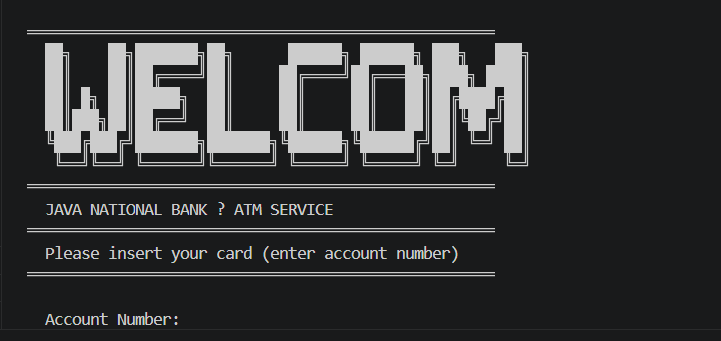
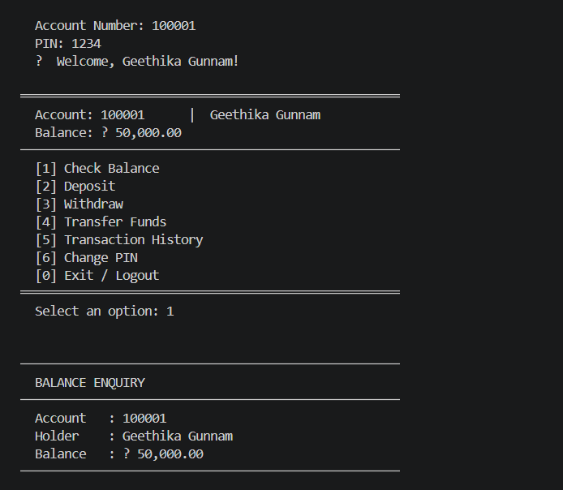
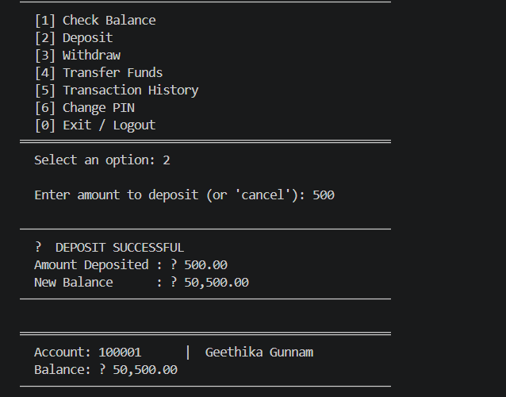
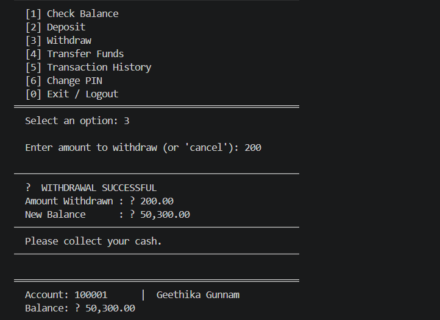
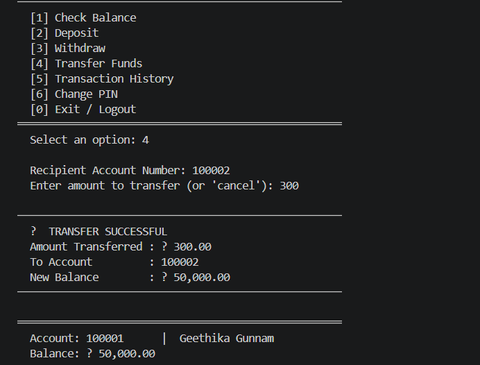
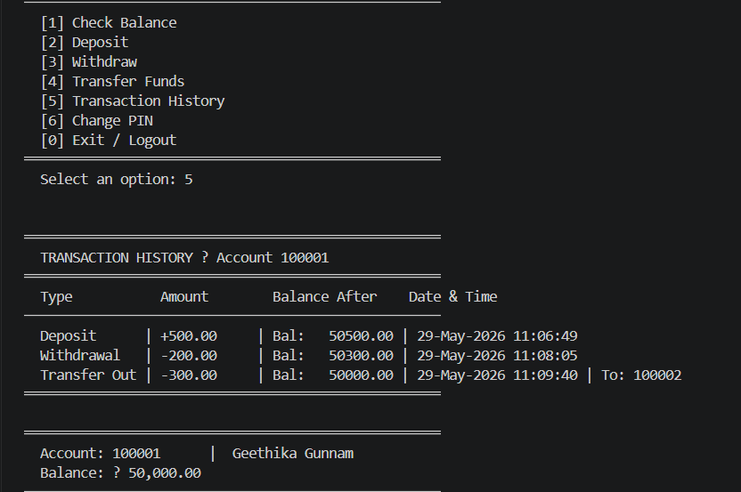

# ATM Interface System (Java)
## Project Overview
The ATM Interface System is a console-based Java application developed using Object-Oriented Programming (OOP) principles. It simulates real-world ATM operations such as user authentication, balance management, fund transfer, transaction history, and PIN management with persistent file-based storage.
This project focuses on modular design, separation of concerns, and practical implementation of backend logic using Java.
## Features
- Secure user authentication (Account Number + PIN)
- Account balance enquiry
- Deposit and withdrawal operations
- Fund transfer between accounts
- Transaction history tracking
- PIN change functionality
- Account lock after multiple failed login attempts
- Persistent data storage using file handling
- Console-based interactive user interface
## Technologies Used
- Java
- Object-Oriented Programming (OOP)
- File Handling
- Collections Framework
- VS Code
- Git & GitHub
## OOP Concepts Used
- Encapsulation
- Abstraction
- Composition
- Separation of Concerns
## Screenshots
### Welcome Screen

### Main Menu

### Check Balance

### Deposit Success

### Withdraw Success

### Transfer Success

### Transaction History

## Future Improvements
- Database Integration using MySQL  
- GUI Version using Java Swing or JavaFX  
- Receipt Generation  
- Admin Dashboard  
- Email/SMS Notifications  
## Author
Gunnam Geethika
